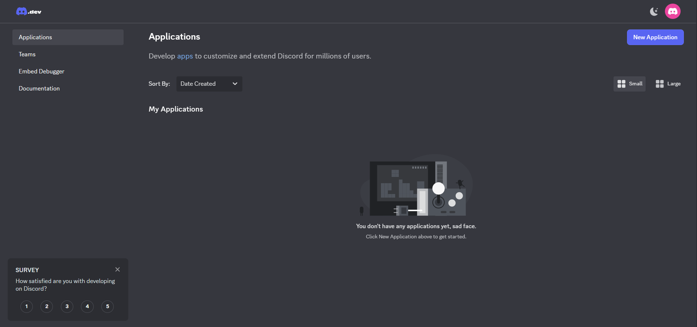
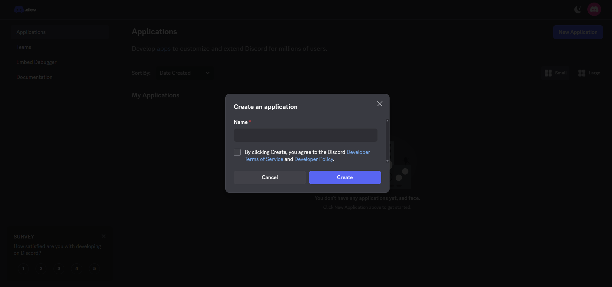
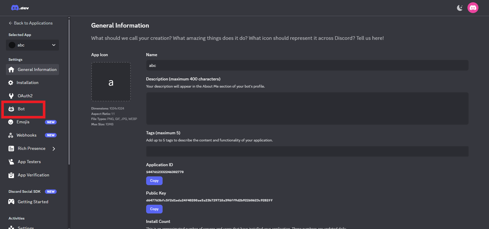
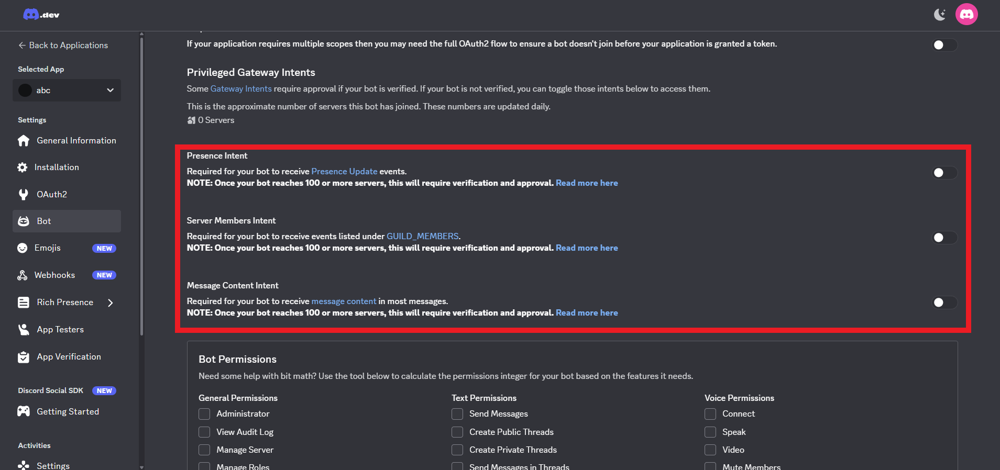
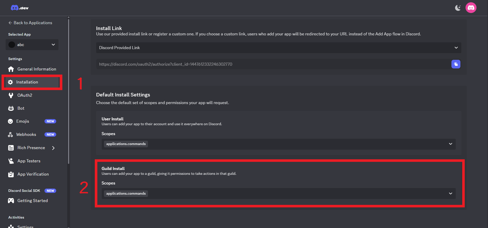
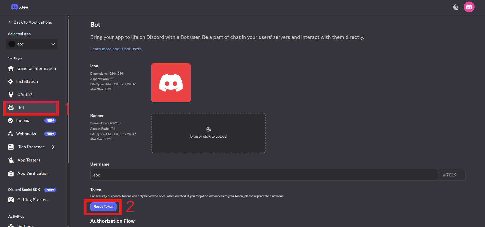
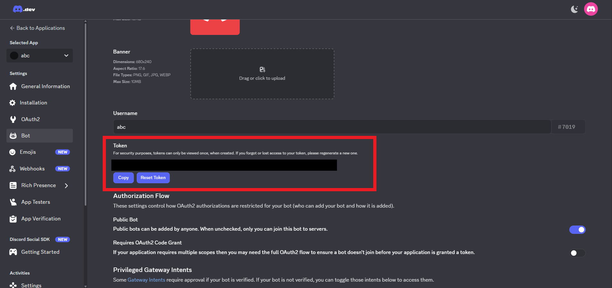

## 註冊 Discord Bot
如果你還沒有 discord 帳號的話 先去註冊一個 ~~這應該不用教吧~~

1. 進入 [Discord Developer Application](https://discord.com/developers/applications) 的網頁

2. 點右上角的 New Application
    - 在 Name 欄位輸入你希望讓你的 Bot 叫什麼名稱
    - 點擊 By clicking...... ~~( 翻譯: 如果你點擊 create(創建)，就代表你同意 Discord 的 [開發者服務條款(Developer Terms of Service)](https://support-dev.discord.com/hc/articles/8562894815383-Discord-Developer-Terms-of-Service) 和 [開發者政策(Developer Policy)](https://support-dev.discord.com/hc/articles/8563934450327-Discord-Developer-Policy) )~~
    - 點擊 Create(創建)

3. 創建之後，應該會進到這樣的頁面。點擊左邊 Settings 那欄的 Bot，接著要給 bot intents 才能讓他正常運作

4. 點擊後，往下滑，把這三個選項都打勾
    - 記得點底下的 Save Changes 這裡就不截圖了有點懶ww

5. (1) 點擊左邊那欄的 **Installation**，我們要讓 Discord 知道他是 Bot ~~(因為單純的 application 也可以被用來顯示 discord 的狀態(rich presence))~~
    - (2) 點擊 **Scopes** 底下這個選單，把 bot 選上
    - 點了之後底下會出現 **Permission(權限)**，這是 Bot 進到伺服器時，會被預設給的權限
    - 在那個選單裡面點擊以下幾個選項
        - Add Reactions (添加表情)
        - Attach Files (傳送檔案、圖片)
        - Connect (連接頻道)
        - Embed Links (傳送 embed，你平常看到那個排版很屌，但是自己卻沒方法可以打出來的東西)
        - Read Message History (閱讀(頻道)訊息歷史)
        - Send Messages (傳送訊息)
        - Speak (說話)
        - Use Slash Commands (使用斜線指令，我也不確定這用不用得到)
        - View Channels (查看頻道)

6. 接著要取得 Token，這個超重要，沒有它 你的 Bot 永遠都不會啟動
    - (1) 進到左邊 Settings 那欄的 Bot    
    - (2) 點擊 Reset Token
    - 點擊紅紅的那個 (Yes, do it!)，他在問你是否確定要重製 Token
        - 因為我們根本沒使用過這個 Bot，所以重製也沒差
    - 點擊後 他可能會需要你驗證一下，可能要你輸入密碼。或者如果你開啟多步驟驗證(Multi-Factor)的話，可能也需要。

7. 結束之後，應該就可以看到你的 Token 了，複製它 (點 Copy，或者你想手動複製都可以)

8. **把這個 Token 留著，不要給別人，等等開啟 Discord Bot 的時候會用到!**